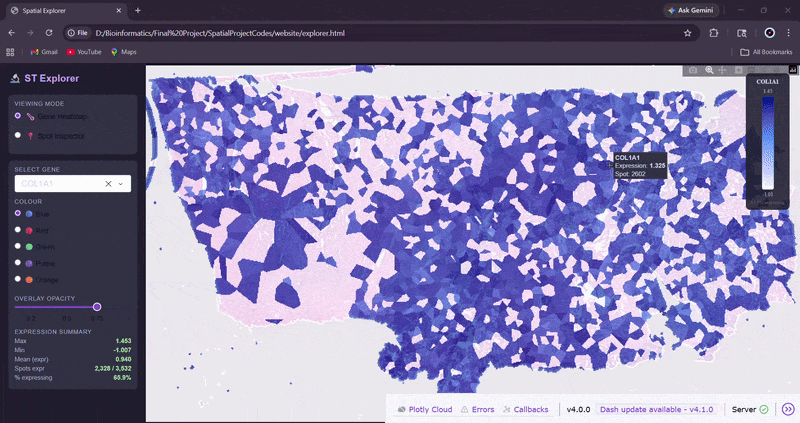
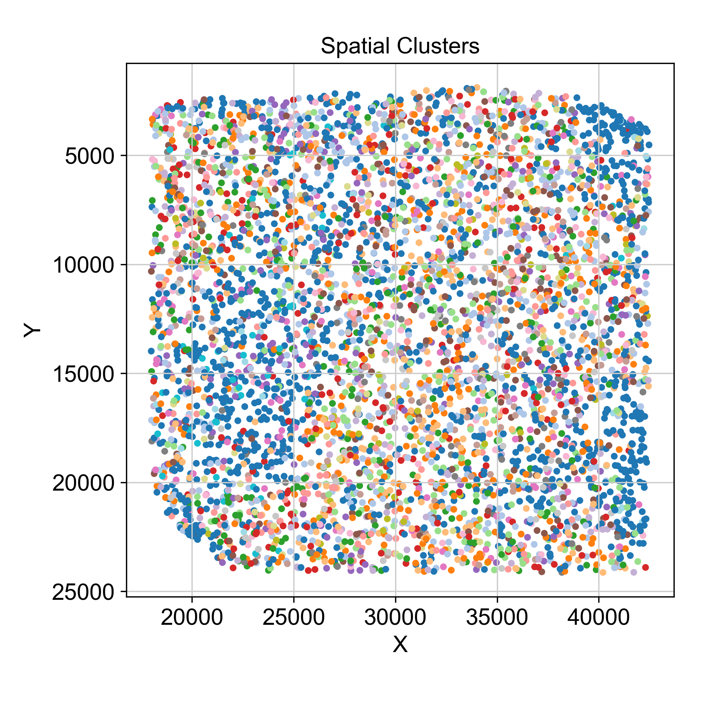
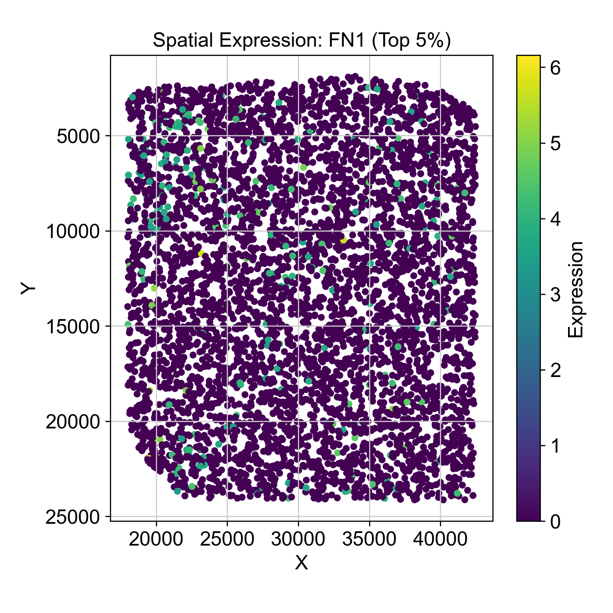
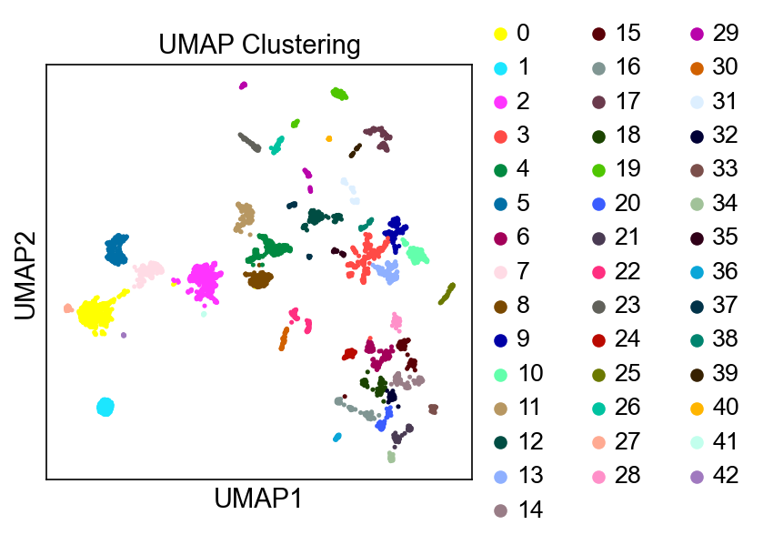
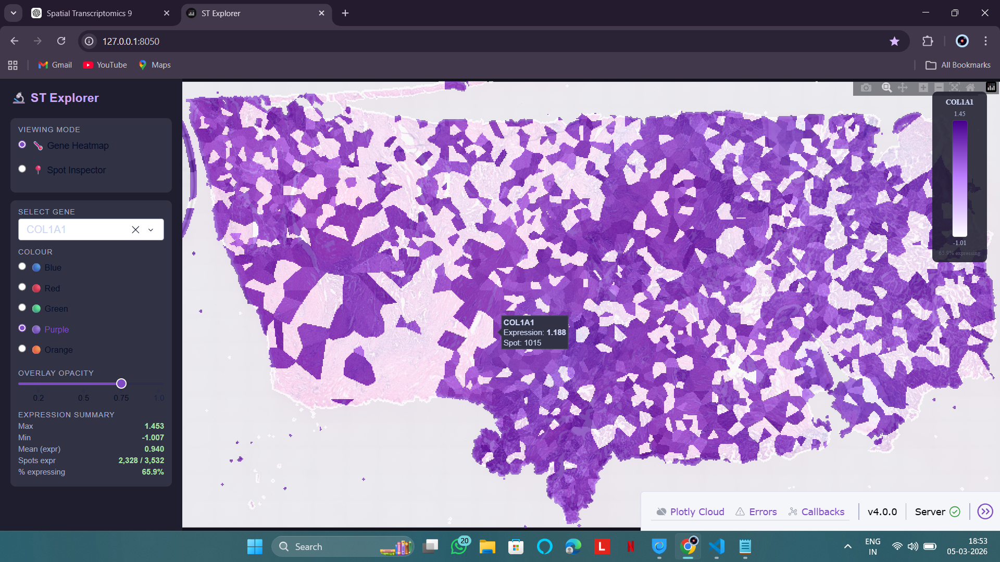
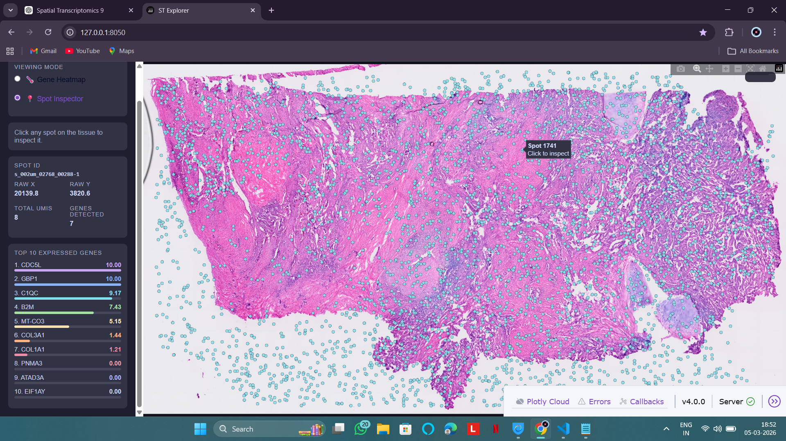

# Spatial_Explorer
# 🧬 Spatial Transcriptomics Explorer

An interactive dashboard for exploring spatial gene expression data using 10x Visium HD datasets.

---

## 🚀 Overview

Spatial transcriptomics enables the study of gene expression within its spatial context in tissue sections. However, interacting with such high-dimensional data often requires complex computational workflows.

This project presents an **interactive dashboard** that simplifies the exploration of spatial gene expression data from 10x Genomics Visium HD datasets.

---

## 🧠 Objective

To develop a user-friendly tool that bridges the gap between:

* Complex spatial transcriptomics analysis pipelines
* Intuitive, interactive data visualization

---

## 🔬 Methodology

### 1. Data Acquisition

* Dataset: 10x Genomics Visium HD Human Lung Cancer
* Input files:

  * `matrix.mtx` (gene expression matrix)
  * `barcodes.tsv` (spot identifiers)
  * `features.tsv` (gene annotations)
  * Spatial coordinates
  * Histology image

---

### 2. Data Preprocessing

Performed using Python and Scanpy:

* Quality control and filtering
* Normalization of gene expression
* Log transformation
* Selection of Highly Variable Genes (HVGs)

---

### 3. Dimensionality Reduction & Clustering

* Principal Component Analysis (PCA)
* Neighborhood graph construction
* Clustering using Leiden algorithm
* UMAP for visualization of clusters

---

### 4. Spatial Integration

* Scaling spatial coordinates using 10x scalefactors
* Alignment of gene expression with histology image
* Mapping clusters onto tissue sections

---

### 5. Dashboard Development

Built using Streamlit:

* Interactive gene selection
* Dynamic visualization updates
* Dual exploration modes:

  * Gene Mode
  * Spot Mode

---

## ⚙️ Tech Stack

* Python
* Scanpy
* AnnData
* Streamlit

---

## 🧪 Features

### 🧪 Gene Mode

* Visualize expression of selected genes
* Overlay gene expression on spatial tissue map
* Identify spatial expression patterns

### 📍 Spot Mode

* Explore clustering results
* Inspect individual spatial spots
* Analyze localized gene behavior

---

## 🖼️ Results

### 🧬 Spatial Clusters

### 🧪 Gene Expression Visualization

### 📊 UMAP Clustering

---

## 🖥️ Dashboard Interface

### Gene Mode

### Spot Mode

---

## ⚠️ Note

Due to project constraints, the full source code is not publicly available.
This repository focuses on methodology, workflow, and outputs.

---

## 🔮 Future Improvements

* Deployment as a web application
* Integration with larger datasets
* Enhanced UI/UX
* Multi-sample comparison capabilities

---

## 🤝 Feedback

Open to feedback, suggestions, and collaboration.
